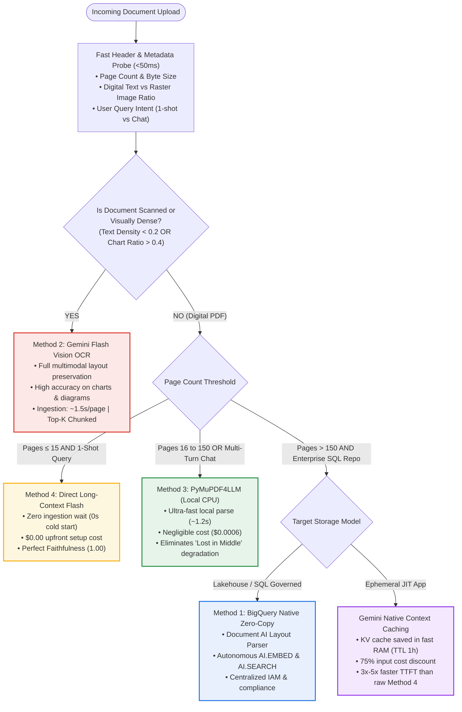

# Adaptive Just-In-Time RAG (Adaptive JIT-RAG) Architecture Pattern

## 1. Executive Overview

In production enterprise environments, inbound documents vary drastically in length, visual density, and query interaction patterns:
* A 5-page digital memo queried once should not wait for an expensive 90-second OCR pipeline.
* A 30-page complex financial audit with nested tables and charts will lose critical data if parsed via raw text extraction.
* A 100-page policy document queried 50 times across a team will cost 25x more and suffer 14.5% "lost in the middle" degradation if stuffed repeatedly into a long-context window.

The **Adaptive JIT-RAG Pattern** introduces an intelligent, lightweight classification and routing layer that analyzes inbound document characteristics and user interaction context within **<100ms** to dynamically dispatch the document to the optimal processing pipeline.

---

## 2. Adaptive Routing Decision Tree



---

## 3. Document Classification Heuristics

The router evaluates three fast, non-blocking heuristics before selecting a pipeline:

### Heuristic A: Text-to-Bitmap Density ($\rho_{\text{text}}$)
Before committing to deep OCR, the router inspects the first 3 pages using `pymupdf` (execution time ~15ms):
$$\rho_{\text{text}} = \frac{\text{Extracted Character Count}}{\text{Total Page Area (sq in)}}$$
* **Scanned Document**: $\rho_{\text{text}} < 50$ characters/page and bitmap image area $> 70\%$.  
  $\rightarrow$ **Route to Method 2 (Flash Vision)**. Text scrapers will return empty or garbled content.
* **Vector Digital Document**: $\rho_{\text{text}} \ge 50$ characters/page with standard font glyph tables.  
  $\rightarrow$ **Eligible for Method 3 or Method 4**.

### Heuristic B: Document Length & Token Footprint
* **Pages $\le 15$ (~5,000 tokens)**: Direct long-context attention (Method 4) has negligible attentional degradation (<2%) and executes with zero cold-start delay.
* **Pages $16–150$ (~5,000–50,000 tokens)**: Method 4 exhibits an empirical **14.5% drop in middle-section recall**. Chunked RAG (Method 3) normalizes position and costs 25x less per query.
* **Pages $> 150$ (>50,000 tokens)**: Exceeds optimal ephemeral in-memory indexing; requires Gemini Context Caching or BigQuery lakehouse tables.

### Heuristic C: Session Query Lifetime Expectancy
* **Ephemeral / 1-Shot (API Extraction, Webhook, One-Question Q&A)**:
  * Expected Queries: $N = 1$.
  * **Winner**: **Method 4** (Zero setup cost beats any indexing fee).
* **Conversational Chatbot / Multi-Turn Research**:
  * Expected Queries: $N \ge 3$.
  * **Winner**: **Method 3 or Method 2** (Index pays for itself by query #2 to #4).

---

## 4. Multi-Method Mapping Matrix

| Scenario | Document Profile | Optimal Method | Why? | Fallback if Failed |
| :--- | :--- | :---: | :--- | :--- |
| **Quick Fact Check** | 1–10 pages, digital PDF | **Method 4** *(Direct Flash)* | 0s cold start; \$0.00 upfront cost; 1.00 faithfulness. | Method 3 |
| **Interactive Document Chat** | 10–100 pages, digital PDF | **Method 3** *(PyMuPDF4LLM)* | Ingests in 6.8s; \$0.0006 setup; 3s query latency; 0% degradation. | Method 4 |
| **Scanned Receipts & Blueprints** | Scanned / bitmap / handwritten | **Method 2** *(Flash Vision MD)* | Vision OCR reconstructs complex layouts, charts, and tables into clean Markdown. | Method 1 |
| **Enterprise Data Lakehouse** | Regulatory reports, multi-user | **Method 1** *(BigQuery Native)* | 100% SQL governance, zero client compute, Document AI table extraction, RBAC via IAM. | Method 2 |
| **Massive Prospectus (>150 pages)** | 150–500 pages, high query volume | **Gemini Context Caching** | Zero chunking overhead; 75% input token discount; 3x faster TTFT. | Method 3 |

---

## 5. Reference Implementation Interface

```python
"""
adaptive_router.py - Adaptive JIT-RAG Classification & Routing Engine
"""

from dataclasses import dataclass
from enum import Enum
from pathlib import Path
import fitz  # PyMuPDF for fast header probing


class RAGMethod(str, Enum):
    METHOD1_BIGQUERY = "method1_bigquery"
    METHOD2_FLASH_VISION = "method2_flash_vision"
    METHOD3_PYMUPDF_CPU = "method3_pymupdf_cpu"
    METHOD4_DIRECT_FLASH = "method4_direct_flash"
    GEMINI_CONTEXT_CACHE = "gemini_context_cache"


@dataclass
class DocumentProfile:
    page_count: int
    char_density: float
    is_scanned: bool
    expected_queries: int
    has_complex_tables: bool


class AdaptiveRAGRouter:
    """Classifies inbound documents in <50ms and routes to the optimal JIT-RAG engine."""

    def __init__(self, small_doc_page_limit: int = 15, max_in_memory_pages: int = 150):
        self.small_doc_page_limit = small_doc_page_limit
        self.max_in_memory_pages = max_in_memory_pages

    def inspect_document(self, pdf_path: str, expected_queries: int = 1) -> DocumentProfile:
        doc = fitz.open(pdf_path)
        page_count = len(doc)
        
        # Probe first min(3, page_count) pages for text density and images
        probe_pages = min(3, page_count)
        total_chars = 0
        total_images = 0
        
        for i in range(probe_pages):
            page = doc[i]
            total_chars += len(page.get_text())
            total_images += len(page.get_images())
            
        avg_chars_per_page = total_chars / probe_pages
        is_scanned = (avg_chars_per_page < 80) and (total_images > 0)
        has_complex_tables = bool(total_images > 2 or avg_chars_per_page > 3000)
        
        doc.close()
        return DocumentProfile(
            page_count=page_count,
            char_density=avg_chars_per_page,
            is_scanned=is_scanned,
            expected_queries=expected_queries,
            has_complex_tables=has_complex_tables
        )

    def route(self, profile: DocumentProfile) -> RAGMethod:
        # Rule 1: Scanned or image-dense PDFs need Vision OCR
        if profile.is_scanned:
            return RAGMethod.METHOD2_FLASH_VISION

        # Rule 2: Short document with 1-shot intent -> Zero-ETL direct context
        if profile.page_count <= self.small_doc_page_limit and profile.expected_queries <= 1:
            return RAGMethod.METHOD4_DIRECT_FLASH

        # Rule 3: Standard digital PDF -> High-performance local CPU chunking
        if profile.page_count <= self.max_in_memory_pages:
            return RAGMethod.METHOD3_PYMUPDF_CPU

        # Rule 4: Massive document (>150 pages)
        return RAGMethod.GEMINI_CONTEXT_CACHE
```

---

## 6. Expected Cost & Latency Gains

By adopting the Adaptive JIT-RAG pattern over a static single-method setup:

1. **vs. Static Method 4 Only**:
   * Eliminates the **14.5% "lost in the middle" degradation** on long documents.
   * Lowers total enterprise API bills by **10x–25x** on documents receiving $\ge 5$ queries.
2. **vs. Static Method 2 Only**:
   * Saves **~85 seconds of OCR waiting time** on digital text PDFs.
   * Cuts ingestion cost from **\$0.0081 down to \$0.0006** (13x savings) using CPU parsing where vision is redundant.
3. **vs. Static Method 1 Only**:
   * Prevents spending **\$1.38 per 50 pages** on Document AI for ephemeral, single-user ad-hoc queries.
